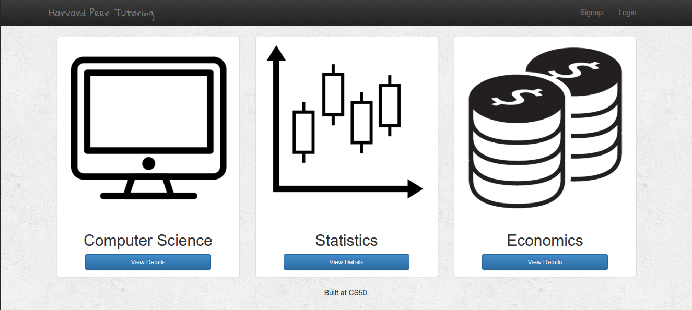
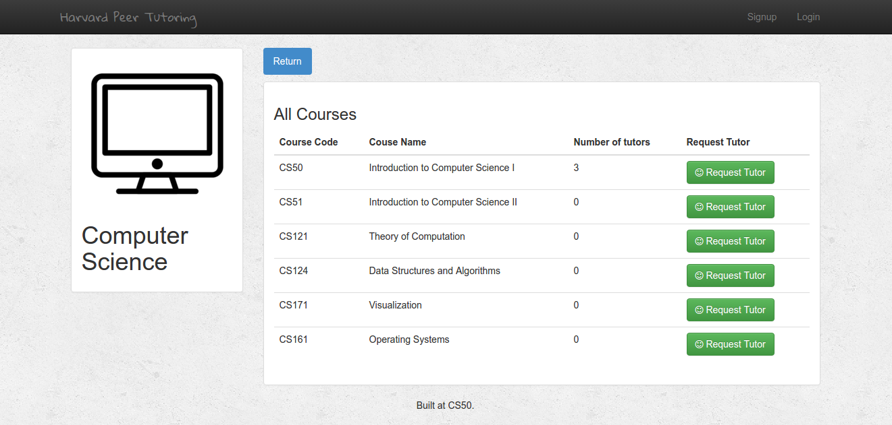

# Harvard Peer Tutoring

### What is Harvard Peer Tutoring?
---

Harvard Peer Tutoring was developed as part of Harvard's CS50 Final Project.
It is a proof-of-concept application that allows Harvard students to search for peer tutors
based on the departments (or concentrations) in a simple, fast, and reliable way.

For this delivery, we have only implemented 13 courses in three departments:

* Computer Science
* Statistics
* Economics

And, two schools:

* College
* Extension

### How does it work?
---

Courses are classified under Departments and Schools. You choose courses you need
help with based on the departments they are based on. For instance, tutoring
assistance on **CS50** would be under the **Computer Science** department and both on
"College" and "Extension" schools.

After choosing a department, you can see courses that have tutors available. If
you need assistance in one of this courses, you can click `Request Tutor` to
request a tutor in that class.

# Setup and Installation

First, install python virtual environment with `virtualenv -p python3 venv` and
activate with the virtual environment with `source venv/bin/activate` and download
dependencies with `pip install -r requirements.txt`

Make code migrations:

		cd harvard
		python manage.py makemigrations
		python manage.py migrate

Create database on localhost

		psql -d postgres
		CREATE DATABASE peer_tutoring WITH OWNER postgres;
		\q

You can take a look at the postgres dump `peer_tutoring.sql`

To run the application

		cd harvard
		python manage.py runserver

**Demo of the project:** harvard-peer-tutoring.herokuapp.com   
**Youtube Video:** https://youtu.be/9Jny6yDaeh4
